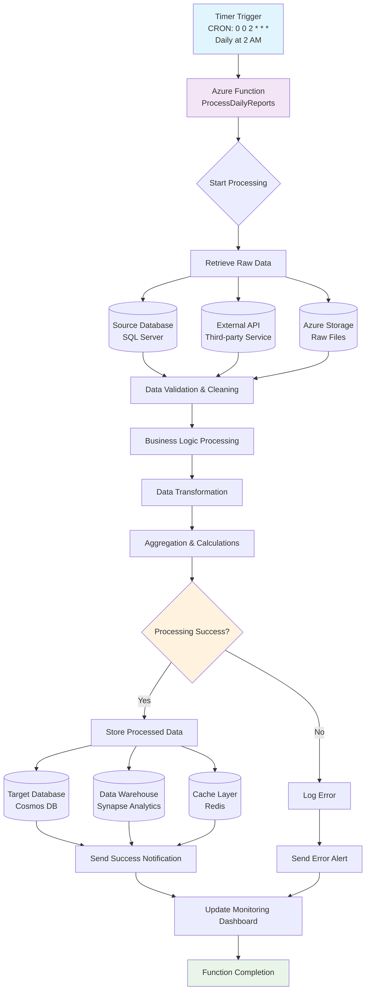

# Azure Function Timer Trigger Example

## Overview

This document demonstrates how to implement an Azure Function with a timer trigger that processes data on a scheduled basis. Timer triggers are ideal for background tasks, data processing, cleanup operations, and scheduled maintenance.

## Function Implementation

### Basic Timer Function

```csharp
using System;
using Microsoft.Azure.WebJobs;
using Microsoft.Extensions.Logging;
using System.Threading.Tasks;

namespace WikiTest.Functions
{
    public class DataProcessingFunction
    {
        [FunctionName("ProcessDailyReports")]
        public async Task Run(
    [TimerTrigger("0 0 2 * * *")] TimerInfo myTimer,
         ILogger log)
        {
       log.LogInformation($"Daily report processing started at: {DateTime.Now}");

            try
  {
        // Step 1: Retrieve data from source
             var rawData = await RetrieveRawDataAsync();
             log.LogInformation($"Retrieved {rawData.Count} records");

     // Step 2: Process and transform data
            var processedData = await ProcessDataAsync(rawData);
           log.LogInformation($"Processed {processedData.Count} records");

        // Step 3: Store results
     await StoreProcessedDataAsync(processedData);
         log.LogInformation("Data processing completed successfully");

        // Step 4: Send notification
    await SendCompletionNotificationAsync(processedData.Count);
            }
         catch (Exception ex)
   {
       log.LogError(ex, "Error occurred during data processing");
await SendErrorNotificationAsync(ex.Message);
           throw;
          }
        }

        private async Task<List<RawDataRecord>> RetrieveRawDataAsync()
     {
      // Implementation for data retrieval
            // Could be from SQL Database, Cosmos DB, external API, etc.
      await Task.Delay(1000); // Simulate processing
    return new List<RawDataRecord>();
        }

     private async Task<List<ProcessedDataRecord>> ProcessDataAsync(List<RawDataRecord> rawData)
   {
            // Implementation for data transformation
      await Task.Delay(2000); // Simulate processing
       return new List<ProcessedDataRecord>();
        }

        private async Task StoreProcessedDataAsync(List<ProcessedDataRecord> processedData)
        {
  // Implementation for storing results
   await Task.Delay(500); // Simulate storage
        }

        private async Task SendCompletionNotificationAsync(int recordCount)
     {
 // Send success notification via email, Teams, etc.
            await Task.Delay(100);
   }

     private async Task SendErrorNotificationAsync(string errorMessage)
        {
    // Send error notification
            await Task.Delay(100);
      }
    }

    public class RawDataRecord
    {
        public int Id { get; set; }
     public string Data { get; set; }
        public DateTime Timestamp { get; set; }
    }

    public class ProcessedDataRecord
    {
   public int Id { get; set; }
        public string ProcessedData { get; set; }
        public DateTime ProcessedAt { get; set; }
 public string Status { get; set; }
    }
}
```

## Timer Trigger CRON Expressions

| Expression | Description | Frequency |
|------------|-------------|-----------|
| `"0 */5 * * * *"` | Every 5 minutes | High frequency |
| `"0 0 * * * *"` | Every hour at minute 0 | Hourly |
| `"0 0 2 * * *"` | Every day at 2:00 AM | Daily |
| `"0 0 9 * * MON-FRI"` | Weekdays at 9:00 AM | Business days |
| `"0 0 0 1 * *"` | First day of each month at midnight | Monthly |

## Data Flow Diagram



## Advanced Features

### Configuration and Dependencies

```csharp
// host.json configuration
{
    "version": "2.0",
    "functionTimeout": "00:10:00",
    "logging": {
   "logLevel": {
     "default": "Information"
        }
    },
    "extensions": {
        "timers": {
            "maxDelay": "00:05:00"
   }
    }
}
```

### Dependency Injection Setup

```csharp
using Microsoft.Azure.Functions.Extensions.DependencyInjection;
using Microsoft.Extensions.DependencyInjection;

[assembly: FunctionsStartup(typeof(WikiTest.Functions.Startup))]

namespace WikiTest.Functions
{
    public class Startup : FunctionsStartup
    {
        public override void Configure(IFunctionsHostBuilder builder)
        {
      builder.Services.AddHttpClient();
       builder.Services.AddSingleton<IDataProcessor, DataProcessor>();
            builder.Services.AddSingleton<INotificationService, NotificationService>();
        }
    }
}
```

### Enhanced Function with Dependency Injection

```csharp
public class EnhancedDataProcessingFunction
{
    private readonly IDataProcessor _dataProcessor;
    private readonly INotificationService _notificationService;
    private readonly ILogger<EnhancedDataProcessingFunction> _logger;

    public EnhancedDataProcessingFunction(
        IDataProcessor dataProcessor,
        INotificationService notificationService,
      ILogger<EnhancedDataProcessingFunction> logger)
    {
        _dataProcessor = dataProcessor;
   _notificationService = notificationService;
        _logger = logger;
    }

    [FunctionName("EnhancedProcessDailyReports")]
    public async Task Run(
        [TimerTrigger("0 0 2 * * *")] TimerInfo myTimer)
    {
        _logger.LogInformation($"Enhanced daily report processing started at: {DateTime.Now}");

        var correlationId = Guid.NewGuid().ToString();
        
   try
        {
        var result = await _dataProcessor.ProcessDailyDataAsync(correlationId);
            await _notificationService.SendSuccessNotificationAsync(result);
   
       _logger.LogInformation($"Processing completed successfully. Correlation ID: {correlationId}");
        }
        catch (Exception ex)
        {
            _logger.LogError(ex, $"Processing failed. Correlation ID: {correlationId}");
await _notificationService.SendErrorNotificationAsync(ex, correlationId);
  throw;
        }
    }
}
```

## Monitoring and Observability

### Application Insights Integration

```csharp
public class MonitoredFunction
{
 private readonly TelemetryClient _telemetryClient;

    public MonitoredFunction(TelemetryClient telemetryClient)
    {
     _telemetryClient = telemetryClient;
    }

    [FunctionName("MonitoredDailyProcess")]
    public async Task Run([TimerTrigger("0 0 2 * * *")] TimerInfo myTimer)
    {
    using var operation = _telemetryClient.StartOperation<RequestTelemetry>("DailyDataProcessing");
        
        try
        {
            // Track custom metrics
    _telemetryClient.TrackMetric("ProcessingStarted", 1);
    
    var stopwatch = Stopwatch.StartNew();
            
    // Processing logic here
   await ProcessDataAsync();
            
            stopwatch.Stop();
            
       // Track performance
    _telemetryClient.TrackMetric("ProcessingDuration", stopwatch.ElapsedMilliseconds);
   _telemetryClient.TrackMetric("ProcessingCompleted", 1);
        }
        catch (Exception ex)
   {
            _telemetryClient.TrackException(ex);
    _telemetryClient.TrackMetric("ProcessingFailed", 1);
            throw;
        }
    }
}
```

## Best Practices

### 1. Error Handling and Resilience

- Implement retry policies for external dependencies
- Use circuit breaker pattern for unreliable services
- Log correlation IDs for distributed tracing
- Handle timeouts gracefully

### 2. Performance Optimization

- Use async/await consistently
- Implement connection pooling for databases
- Cache frequently accessed data
- Process data in batches to manage memory

### 3. Security Considerations

- Use Azure Key Vault for sensitive configuration
- Implement proper authentication for external services
- Follow principle of least privilege for permissions
- Validate and sanitize input data

### 4. Monitoring and Alerting

- Set up Application Insights for telemetry
- Create alerts for function failures
- Monitor function execution duration
- Track business metrics and KPIs

## Deployment Configuration

### ARM Template Example

```json
{
    "$schema": "https://schema.management.azure.com/schemas/2019-04-01/deploymentTemplate.json#",
    "contentVersion": "1.0.0.0",
    "parameters": {
  "functionAppName": {
        "type": "string",
            "metadata": {
        "description": "Name of the Azure Function App"
        }
        }
    },
    "resources": [
      {
     "type": "Microsoft.Web/sites",
      "apiVersion": "2021-02-01",
      "name": "[parameters('functionAppName')]",
            "location": "[resourceGroup().location]",
      "kind": "functionapp",
            "properties": {
       "serverFarmId": "[resourceId('Microsoft.Web/serverfarms', variables('hostingPlanName'))]",
   "siteConfig": {
          "appSettings": [
    {
         "name": "FUNCTIONS_WORKER_RUNTIME",
          "value": "dotnet"
            },
   {
  "name": "FUNCTIONS_EXTENSION_VERSION",
     "value": "~4"
 }
           ]
       }
    }
     }
    ]
}
```

## Testing Timer Functions

### Unit Testing Example

```csharp
[TestClass]
public class DataProcessingFunctionTests
{
    [TestMethod]
    public async Task Run_ShouldProcessDataSuccessfully()
    {
        // Arrange
        var logger = new Mock<ILogger>();
var timerInfo = new TimerInfo(null, new ScheduleStatus(), false);
        var function = new DataProcessingFunction();

        // Act & Assert
        await function.Run(timerInfo, logger.Object);
        
      // Verify logging occurred
    logger.Verify(
       x => x.Log(
                LogLevel.Information,
 It.IsAny<EventId>(),
      It.Is<It.IsAnyType>((v, t) => v.ToString().Contains("started")),
  It.IsAny<Exception>(),
        It.IsAny<Func<It.IsAnyType, Exception, string>>()),
            Times.Once);
    }
}
```

## Related Documentation

- [Azure Functions Timer Trigger Reference](https://docs.microsoft.com/en-us/azure/azure-functions/functions-bindings-timer)
- [CRON Expression Reference](https://docs.microsoft.com/en-us/azure/azure-functions/functions-bindings-timer#ncrontab-expressions)
- [Azure Functions Best Practices](https://docs.microsoft.com/en-us/azure/azure-functions/functions-best-practices)